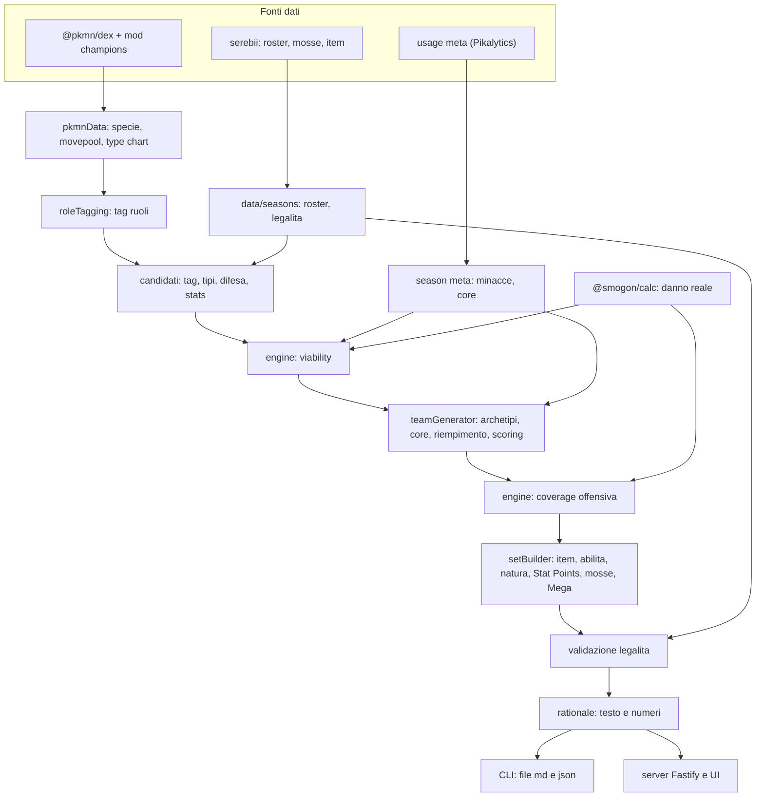

# Documentazione tecnica - Pokémon Champions Team Builder

> Documento tracciato, destinato a un lettore tecnico. Spiega lo stack, i tool open source e la matematica del motore di generazione dei team. I riferimenti al codice sono nella forma`percorso:simbolo`. La fonte di verità resta il codice; questo documento lo descrive allo stato attuale e va aggiornato quando il motore cambia.

## 1. Cos'è e come è fatto

L'applicazione è un costruttore di team competitivi per Pokémon Champions. Dato il roster legale di una stagione e una descrizione del meta, produce alcune proposte di squadra per il formato doppio (VGC), ciascuna completa di composizione, ruoli, set giocabili, copertura difensiva e offensiva con numeri di danno reali, e un testo di spiegazione. Il ragionamento è per sinergie e copertura, non una simulazione turno per turno: il danno viene dal calcolatore ufficiale Smogon, non da un motore di battaglia proprio.

Lo stack è interamente Node.js[^node] con TypeScript. Il server web è Fastify; il frontend è una singola pagina statica servita dal server. La gestione dei dati di stagione è a file, senza database. L'esecuzione è identica su Windows e Linux.

## 2. Tool open source e licenze

Tutto ciò che il progetto usa è open source con licenza permissiva. I dati di gioco e il calcolo del danno provengono dall'ecosistema costruito attorno a Pokémon Showdown[^showdown], lo stesso che alimenta il calcolatore ufficiale Smogon.

| Pacchetto         | Licenza | Ruolo nel progetto                                                                 |
| ----------------- | ------- | ---------------------------------------------------------------------------------- |
| `@pkmn/dex`       | MIT     | Dati di gioco: specie, statistiche base, abilità, movepool, type chart             |
| `@pkmn/mods`      | MIT     | Mod `champions`: dati e regole del formato Pokémon Champions sopra la Gen 9        |
| `@pkmn/data`      | MIT     | Costruisce la `Generation` che `@smogon/calc` consuma, a partire dalla dex moddata |
| `@smogon/calc`    | MIT     | Motore ufficiale del calcolatore Smogon: formula del danno reale, gen 1-9          |
| `fastify`         | MIT     | Web server                                                                         |
| `@fastify/static` | MIT     | Serve il frontend statico                                                          |
| `js-yaml`         | MIT     | Parsing dei file meta di stagione                                                  |
| `vitest`          | MIT     | Test runner                                                                        |
| `tsx`             | MIT     | Esecuzione di TypeScript senza passo di build, in sviluppo e in avvio              |

Le pagine di disponibilità del formato (Pokémon, mosse, strumenti) sono consultate da serebii.net e trasformate in file dati versionati da appositi scraper deterministici. La mod `champions` specifica vive nel repository MIT di Pokémon Showdown ed è esposta su npm da `@pkmn/mods`; la sua variante`championsregma` applica le restrizioni della Regulation M-A, mentre la legalità della Regulation M-B corrente è curata dal progetto sopra i dati della mod, perché non ancora pubblicata dalla community (vedi `.claude/memory/decisions.md`, ADR-005 e ADR-007).

### 2.1 Cosa è fonte di verità esterna e cosa è euristica del progetto

La distinzione è la chiave per capire da dove vengono i numeri. Sono fonte di verità esterna, ripresi senza reimplementarli, i dati di gioco e il calcolo: le statistiche base, i tipi, le abilità e i movepool vengono da `@pkmn/dex` più la mod `champions`; il type chart viene dalla stessa dex; la formula del danno viene da `@smogon/calc`; la lista di disponibilità e legalità del formato viene da serebii.net; le minacce e i core del meta vengono dalle usage stats reali (Pikalytics, ChampionsMeta). Tutte queste fonti sono elencate in `docs/SOURCES.md`.

Sono invece euristiche di progetto, cioè scelte di design nostre con costanti tarate a mano, le regole di tagging dei ruoli (§4.2), la stima con cui si sceglie la mossa migliore per una coppia (§4.3), e soprattutto i pesi e le soglie di viability e scoring (§4.4-§4.6). Questi numeri non provengono da una fonte esterna: sono il modello con cui il progetto traduce i fatti verificati in una preferenza di squadra, e sono esplicitati qui proprio perché siano ispezionabili e modificabili.

## 3. Architettura e flusso

Il motore è una pipeline deterministica in cui ogni stadio ha una responsabilità unica. Il punto di accesso ai dati di gioco è `src/pkmnData.ts:getChampionsDex`, che carica `@pkmn/dex` applicando la mod `champions` tramite `Dex.mod('champions', …)`. Da qui derivano le query su specie, movepool e mosse, la mappa difensiva di type-effectiveness (`src/pkmnData.ts:getDefenseMap`) e l'arricchimento dei candidati (`src/pkmnData.ts:buildCandidates`).

L'orchestrazione vive in `src/engine.ts:generateForSeason`, che legge i file di stagione, calcola la *viability* di ogni candidato, invoca la generazione, esegue la verifica offensiva col damage calc e costruisce i set completi e il testo. Il tagging dei ruoli è in `src/roleTagging.ts:tagRoles`, la generazione e lo scoring in `src/teamGenerator.ts:generateTeams`, il damage calc in
`src/calc.ts:bestDamagePercent`, la costruzione dei set in `src/setBuilder.ts:buildSet`, il testo in
`src/rationale.ts:buildRationale`. Lo stesso motore alimenta sia la CLI (`scripts/generate.ts`) sia
il server (`src/server.ts`).

La pipeline è rappresentata dal diagramma sotto. Il sorgente Mermaid canonico è
`.claude/context/diagrams/pipeline.mmd` e la versione resa è
[`.claude/context/diagrams/pipeline.svg`](../.claude/context/diagrams/pipeline.svg), generata con
`tools/render-diagrams.mjs`. Il blocco Mermaid seguente è reso nativamente da GitHub.





## 4. La matematica del motore

### 4.1 Efficacia di tipo difensiva

Il type chart arriva dalla dex moddata: per ogni tipo difensore, `damageTaken` mappa il tipo attaccante a un codice intero. Il progetto lo traduce in moltiplicatore con la corrispondenza `0 → 1` (neutro), `1 → 2` (debole), `2 → 0.5` (resiste), `3 → 0` (immune), e per un Pokémon con uno o due tipi calcola il moltiplicatore difensivo verso ogni tipo attaccante come prodotto sui suoi tipi.

```
mult(difensore, tipoAtt) = Π_{t ∈ tipi(difensore)}  codeToMult( damageTaken[t][tipoAtt] )
```

Un *debole impilato* è un tipo verso cui almeno tre membri della squadra hanno moltiplicatore maggiore di 1; è il segnale difensivo centrale dello scoring (`src/teamGenerator.ts:stackedWeaknesses`).

### 4.2 Tagging dei ruoli

A ogni Pokémon si assegnano tag di ruolo con regole deterministiche su statistiche base, abilità e movepool (la tabella §4.1 dell'handoff, implementata in `src/roleTagging.ts:tagRoles`). Per esempio`screens_setter` richiede l'abilità Prankster più Reflect o Light Screen nel movepool;`trick_room_setter` richiede velocità base non superiore a 60 più Trick Room; `wallbreaker` richiede Attacco o Attacco Speciale base almeno 110 in assenza di recupero affidabile. Il controllo della
velocità "in avanti" (`speed_control`) considera Tailwind, Icy Wind ed Electroweb ed è tenuto distinto dal Trick Room, che è controllo inverso, così un setter di Trick Room non viene scambiato per un membro adatto a un team Tailwind.

### 4.3 Damage calc reale

Da dove viene il numero del danno. Il danno non è stimato dal progetto: è calcolato da `@smogon/calc`, il motore del calcolatore ufficiale Smogon (`calc.pokemonshowdown.com`), su una `Generation` di`@pkmn/data` costruita dalla dex moddata `champions` (`src/calc.ts:getChampionsGen`), con un predicatodi esistenza permissivo per non escludere specie marcate non standard dalla mod. Quel motore
implementa la formula canonica del danno delle generazioni Pokémon, la stessa documentata su Bulbapedia (vedi `docs/SOURCES.md` §3). Nella forma di Gen 9 la formula è, in sintesi:

```
danno = ( ( (2·Livello/5 + 2) · Potenza · A/D ) / 50 + 2 ) · M
  A, D  = Attacco (o Att.Sp.) dell'attaccante e Difesa (o Dif.Sp.) del difensore, con boost/natura
  M     = prodotto dei modificatori: STAB, efficacia di tipo, bersagli (0.75 in doppio multi-target),
          meteo, abilità (es. Adaptability, Huge Power, Thick Fat, Multiscale), oggetto, critico,
          e il roll casuale 0.85-1.00
```

Il progetto consuma questa formula tramite il pacchetto e non la reimplementa; ciò che è "nostro" è solo come impostiamo i due Pokémon e quale mossa scegliamo. Entrambi i contendenti ricevono la loro abilità competitiva (`src/setBuilder.ts:pickCompetitiveAbility`), così il calcolo rispetta immunità e
modificatori reali: una mossa di Terra contro un Pokémon Levitate dà zero, Thick Fat dimezza Fuoco e Ghiaccio, Adaptability e Huge Power alzano l'offesa.

Il meteo e il terreno sono offerti come opzioni (`DamageOptions.weather`/`terrain` in `src/calc.ts`): la baseline resta neutra, ma quando un team ha un weather/terrain setter tra i membri (`src/pkmnData.ts:teamWeather`/`teamTerrain`) la sua coverage offensiva viene calcolata sotto quel campo, così una squadra pioggia vede le STAB Acqua potenziate (verificato: Basculegion Wave Crash vs Garganacl da circa 104% a 156% sotto pioggia). Punto chiave: il PUNTEGGIO e l'ordinamento usano sempre il campo che il team imposta da solo (auto); l'override manuale dalla UI è solo una lente di visualizzazione del danno mostrato e non riordina i team (un team senza setter non sale in cima sotto un meteo forzato che non potrebbe garantire). Anche gli strumenti entrano nel calcolo: l'attaccante usa lo strumento reale del proprio set (Life Orb potenzia del 30 per cento) nella coverage, e il difensore usa il proprio nel controllo di vulnerabilità. La *viability* per candidato resta neutra, perché team-agnostica. Resta fuori dalla baseline il modificatore 0.75 dei colpi multi-bersaglio, perché la coverage è a bersaglio singolo.

La scelta della mossa con cui un attaccante colpisce un bersaglio è invece un'euristica deterministica nostra: tra le mosse del movepool, escluse quelle poco pratiche in doppio (a due turni, con ricarica, differite, sotto l'80 per cento di precisione, o condizionali come Focus Punch) e quelle a cui il difensore è immune per abilità (per esempio una mossa di Terra contro Levitate), si massimizza una stima e si calcola il danno reale solo per la mossa scelta.

```
stima(mossa) = potenzaBase · STAB · efficacia · statOffensiva · meteo
  STAB           = 1.5 se il tipo della mossa è tra i tipi dell'attaccante, altrimenti 1
  efficacia      = moltiplicatore difensivo del bersaglio verso il tipo della mossa (§4.1)
  statOffensiva  = Attacco base per le mosse fisiche, Att. Speciale base per le speciali
  meteo          = 1.5 / 0.5 sulle mosse Acqua/Fuoco sotto pioggia, viceversa sotto sole, altrimenti 1
```

Il calcolo usa il livello 50 e uno spread standard, massimo investimento nella stat offensiva coerente con la categoria della mossa e natura potenziante, contro un bersaglio investito in PS e nella difesa pertinente. La percentuale di danno è il rapporto tra il danno massimo e i PS massimi del bersaglio. I risultati sono memoizzati per coppia attaccante-difensore, perché le stesse coppie ricorrono tra i team. Il filtro di praticità è condiviso tra il damage calc e la costruzione dei set (`src/setBuilder.ts:isPracticalDoublesMove`), così le stime e i set restano coerenti.

### 4.4 Viability competitiva

Il difetto della prima versione era selezionare i membri premiando la versatilità dei tag e la difesa grezza, ignorando la forza reale: ne uscivano sempre gli stessi Pokémon, anche deboli. La correzione (ADR-008) introduce una *viability* in `[0,1]` calcolata in `src/engine.ts:computeViability`, che àncora la scelta al danno reale e alla solidità.

```
viability = 0.40 · metaOffense + 0.20 · metaDefense + 0.18 · bulk + 0.12 · bst + 0.10 · velocita

  metaOffense = min( media_su_minacce( min(dannoMax%, 150) ) / 100 , 1 )
  metaDefense = frazione di minacce a cui il candidato resiste in modo solido
                (resiste ad almeno una STAB della minaccia e non è debole a nessuna)
  bulk        = min( (PS + Dif + DifSpec) / 320 , 1 )
  bst         = min( sommaStatisticheBase / 700 , 1 )
  velocita    = min( Velocita base / 130 , 1 )
```

Il termine `metaOffense` viene dal damage calc reale contro le minacce del meta, quindi un Pokémon è giudicato forte se colpisce davvero il meta corrente; il termine `bulk` impedisce che un attaccante fragile ad alto danno grezzo scavalchi mostri più solidi.

### 4.5 Generazione, riempimento e diversità

Per ogni archetipo disponibile (incrociando i conteggi dei tag nel roster) si sceglie un core prendendo, per ciascun ruolo richiesto, il candidato con quel tag e viability più alta; i core osservati nel meta (`common_cores`) seedano proposte dedicate. Gli slot rimanenti si riempiono con una salita greedy che massimizza un punteggio marginale (`src/teamGenerator.ts:marginalScore`).

```
marginale(candidato) = 4 · viability
                     + 1.2 · (debolezze impilate correnti a cui il candidato resiste)
                     − 1.0 · (nuove debolezze impilate introdotte)
                     − 0.75 · (tipi del candidato già presenti su ≥2 membri)
                     − 1.5 · (quante volte la specie è già stata usata in altri team)
```

L'ultimo termine è il meccanismo di diversità: la penalità di riuso evita che le stesse specie compaiano in ogni proposta, pur lasciando ricorrere i Pokémon genuinamente più forti.

### 4.6 Scoring del team

Il punteggio di una squadra (`src/teamGenerator.ts:scoreTeam`) parte da una base e somma copertura difensiva, sinergia di supporto, copertura difensiva delle minacce, qualità media e aderenza ai core di meta.

```
score = 10
      − 2.0 · (numero di debolezze impilate)
      + 0.25 · min(tipi resistiti da almeno un membro, 12)
      + 0.30 · (ruoli di supporto distinti presenti)        // speed_control, redirection, pivot, screens, TR
      + 0.50 · (minacce con risposta difensiva solida)
      + 3.0 · (viability media del team)
      + 1.5 · (core di meta interamente presenti nel team)
```

Su questo, l'engine aggiunge la copertura offensiva verificata col damage calc: per ogni minaccia del meta si trova la risposta migliore (danno massimo) tra i membri, si considera *solida* quella che arriva almeno al 50 per cento, e si somma `0.5` per ogni risposta solida (`src/engine.ts`, post-pass). Le proposte si ordinano per punteggio finale.

### 4.7 Costruzione del set

Per ogni membro si costruisce un set completo (`src/setBuilder.ts:buildSet`). L'abilità si sceglie per preferenza competitiva, considerando anche quella nascosta; lo strumento dipende dal ruolo e resta entro gli strumenti legali nel formato; le mosse combinano la migliore STAB, una mossa di copertura scelta per colpire super-efficace il maggior numero di minacce del meta (il valore di coverage per tipo è calcolato in `src/engine.ts` dai tipi delle top_threats), la mossa di ruolo (schermi, redirezione, Trick Room, controllo velocità o setup) e Protect, staple del doppio. La natura e il bilanciamento dipendono dal contesto della squadra: un attaccante lento riceve natura potenziante con velocità minima solo dentro un team Trick Room, non dentro un team Tailwind.

Le statistiche non usano gli EV/IV tradizionali ma gli *Stat Points* di Champions: 66 punti totali, massimo 32 per statistica (§0.5 dell'handoff). Lo spread tipico investe 32 in due statistiche più 2 di resto, secondo il ruolo. Quando un membro dispone di una Mega evoluzione, una sola per squadra (la Mega con somma statistiche più alta) riceve la Mega Stone e adotta statistiche, tipi e abilità della forma Mega (`src/pkmnData.ts:getMegaForme`).

### 4.8 Modello degli spread e vulnerabilità strutturale

Il damage calc lavora nel modello EV tradizionale di Smogon (la baseline con cui si confrontano i calc da torneo). Gli *Stat Points* di Champions del set (66 totali, due statistiche a 32) sono la rappresentazione in-game parallela; per il controllo di vulnerabilità vengono rifusi in EV con la corrispondenza 32 SP = 252 EV in proporzione (`src/engine.ts:spToEvs`), così il danno in arrivo è misurato sulla stazza REALE del set e non su un 252/252 fisso. L'attaccante (la minaccia, dallo spread ignoto) resta alla baseline offensiva standard.

Da qui la regola di vulnerabilità strutturale (`src/engine.ts`): per ogni membro con un ruolo difensivo (schermi, redirezione, pivot, Trick Room setter, weather setter), che per ruolo dovrebbe reggere i colpi, si calcola il colpo più forte in arrivo dalle minacce del meta usando lo spread effettivo del set. Si tiene la vulnerabilità peggiore della squadra: se quel colpo è un OHKO (danno massimo oltre il 100 per cento dei PS), si emette una sola nota di avviso per team. Gli attaccanti, fragili per ruolo, non vengono segnalati: un loro OHKO è atteso. La soglia è l'OHKO sullo spread reale del set, e l'esito è una nota, non una modifica automatica dello spread.

### 4.9 Legalità di formato

Gli strumenti e le mosse legali nel formato sono estratti da serebii.net in `data/seasons/legal_<id>.json`
(`scripts/fetch_legality.ts`). Dopo la costruzione, ogni set è validato (`src/engine.ts:validateSet`):
uno strumento non disponibile nel formato viene sostituito con un fallback legale e segnalato, e le mosse fuori lista sono evidenziate. Questo controllo ha già corretto un errore reale, l'uso di Safety Goggles, non disponibile in Regulation M-B.

## 5. Modello dati e aggiornamento stagionale

I dati di una stagione vivono sotto `data/seasons/`. Il file `season_<id>.json` contiene il formato, il regolamento con il suo periodo di validità e le clausole, e la lista delle forme disponibili, popolata dallo scraper `scripts/fetch_roster.ts` dalle pagine serebii. Il file`season_<id>_meta.yaml`, curato a mano, contiene le minacce del meta (`top_threats`) e i core osservati (`common_cores`). Il file `legal_<id>.json` elenca strumenti e mosse legali. I team salvati dall'interfaccia finiscono in `data/generated_teams/` come .json timestampati e diffabili.

A ogni nuova stagione il lavoro si riduce a rieseguire gli scraper e aggiornare il meta a mano, senza toccare il codice, salvo meccaniche mai viste prima che richiedano un nuovo tag di ruolo.

## 6. Esecuzione e deploy

In locale si esegue `npm install` seguito da `npm run dev`, che avvia il server su
`http://127.0.0.1:5187` (porta e host sovrascrivibili con `PORT` e `HOST`). La CLI offline è`npm run generate`. Il deploy web gratuito è descritto da `render.yaml` per Render (vedi `.claude/context/deployment.md`).

## 7. Limiti noti e direzioni

Il damage calc modella le abilità di entrambi i contendenti (immunità, riduttori, boost) ed è il principale guadagno di realismo. Il meteo non è più solo escluso: è offerto come opzione e applicato automaticamente quando un team imposta un meteo, mentre la viability per candidato resta neutra (§4.3). Anche la scelta della mossa ora salta le mosse a cui il difensore è immune per abilità. Restano scelte di baseline neutra, non difetti nascosti: il calcolo non assume un oggetto sul difensore del meta (item ignoto), non assume terreno, e stima il danno a bersaglio singolo invece del modificatore 0.75 dei colpi multi-bersaglio del doppio; queste casistiche sono comunque esprimibili come opzioni di campo (`DamageOptions`/`Field`) e potranno essere esposte in UI. La scelta della mossa e il bilanciamento dei set restano euristiche con costanti tarate a mano, migliorabili.

Limitazione di dati, non di codice: la mod `champions` del pacchetto npm `@pkmn/mods` (versione 0.10.11) include 48 Mega evoluzioni, tutte nominate `<Base>-Mega`, e `src/pkmnData.ts:getMegaForme` le cattura tutte. Alcune Mega della generazione Z-A elencate su serebii (per esempio Mega Raichu X/Y e Mega Clefable) non sono ancora presenti in quei dati e quindi non sono costruibili finché il pacchetto non si aggiorna; non è un errore del nostro codice ma un ritardo della fonte a monte.

Il meta M-B è ora basato sulle usage stats reali (vedi `docs/SOURCES.md` §6) e va riallineato a ogni rilettura. Il rationale di Livello 2 in prosa naturale via API Claude è previsto ma non implementato. Queste direzioni sono tracciate in `.claude/context/current-work.md` e `.claude/context/roadmap.md`.

## 8. Riferimenti

L'inventario completo e categorizzato di tutte le fonti usate dal progetto (pacchetti software con licenza, dati di gioco, formule di meccanica, pagine serebii, usage stats, fonti ufficiali e hosting) è in `docs/SOURCES.md`.

[^node]: *Node.js* - runtime JavaScript lato server, cross-platform.
[^showdown]: *Pokémon Showdown* - simulatore di battaglie open source (MIT) da cui derivano i pacchetti `@pkmn` e `@smogon` usati qui.
